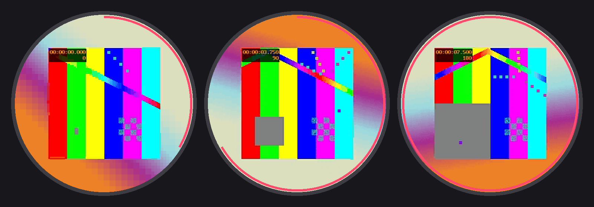

# ZV — full-screen video for Zepp OS watches

ZV is a small video codec and player for Amazfit / Zepp OS watches. It plays
short clips **full screen** (a 239×240 picture scaled 2× to 478×480 on a
480×480 display) at 12 fps with sound, while keeping files small enough for
Bluetooth: about **15 KB/s of video + 4 KB/s of audio** by default, so a
10-second clip is ~200 KB.



*Frames produced by the decoder from the synthetic demo clip
(`tools/make-demo.sh`), drawn on a round screen mock-up.*

The repository contains:

- **the codec** — a Python encoder (`encoder/zv.py`) and a JavaScript decoder for
  the watch (`watch/lib/zv.js`), bit-exact with each other;
- **the player** — a drop-in module for Zepp OS apps (`watch/lib/player.js`):
  decoding ahead of playback, mp3 sound, looping;
- **tools** — convert any video to `.zv`, preview it, verify and benchmark the
  decoder, build an install QR code;
- **an example app** — *«Мемы»* (Memes): a TikTok-style feed of video memes from
  Coub, with a server that fetches and encodes them (`watch/`, `server/`).

## How it works (short version)

Zepp OS cannot decode video, and drawing pixels from JavaScript is far too slow.
But two things turn out to be fast:

1. an `IMG` widget displays a **PNG file written by the app at runtime**
   (`data://...`) and can scale it to the widget size (`auto_scale`);
2. typed-array operations in JavaScript (`copyWithin`, `fill`, `Uint32Array`
   stores) run natively.

So the watch keeps a frame buffer that **is** the byte image of an uncompressed
PNG (a palette PNG with a single *stored* deflate block). Each frame of the
`.zv` stream describes how to update that buffer — 8×8/4×4 blocks that are
skipped, copied with motion, filled with a colour, or drawn as a two-colour
pattern — with all symbols compressed by rANS. The watch applies the updates,
writes the buffer to a file with one `writeSync` and sets it as the `IMG`
source. The PNG checksums are precomputed by the encoder, so the watch never
touches pixels it does not have to.

Details: [docs/FORMAT.md](docs/FORMAT.md).

## Quick start: convert a video

Requirements: Python 3.9+, `numpy`, `Pillow`, `ffmpeg` in `PATH`.

```bash
pip install numpy pillow
python3 encoder/zvcli.py input.mp4 clip.zv --sec 10 --preview clip.png
```

```
input.mp4: 120 frames, video 162.8 KB (1.36 KB/frame, 16.3 KB/s), audio 39.4 KB, file 208.3 KB, error 3.61, 14 s
```

Any input ffmpeg understands works. `--kbps` sets the video rate (default 15
KB/s), `--fps` the frame rate (default 12), `--fit contain` letterboxes
instead of cropping. All options and tips: [docs/ENCODING.md](docs/ENCODING.md).

Check the result:

```bash
python3 encoder/zvpreview.py clip.zv frames.png   # eight decoded frames as on the watch
node tools/zvtest.mjs clip.zv                     # run the watch decoder, compare checksums
qjs --std tools/zvbench.mjs clip.zv               # decoder speed in QuickJS
```

## Quick start: play it on a watch

Copy `watch/lib/zv.js`, `player.js`, `fsx.js` and `audio.js` into your Zepp OS
app (API 3.0+), put `clip.zv` into `assets/<target>/`, then:

```js
import * as hmUI from '@zos/ui'
import { createPlayer } from '../lib/player'

const img = hmUI.createWidget(hmUI.widget.IMG, { x: 1, y: 0, w: 478, h: 480, auto_scale: true, src: '' })
const player = createPlayer(img, {
  onStatus: (phase, p) => console.log(phase, Math.round(p * 100) + '%'),
})
player.load('clip.zv', true, 'clip') // true = the file is in the app package
```

API, permissions and file management: [docs/PLAYER.md](docs/PLAYER.md).

## The example app

`watch/` is a complete Zepp OS app: swipe up/down (or turn the crown) for the
next/previous meme, tap to pause, long press to switch quality. Every launch
shows memes you have not seen yet. Memes come from the public
[Coub](https://coub.com) API (Memes community, NSFW filtered out); the phone
cannot run ffmpeg, so `server/` encodes them, and the phone side of the app
downloads the `.zv` file and transfers it to the watch. The app UI is in
Russian.

```bash
tools/make-demo.sh                    # bundled demo clip (license-free test pattern)
cd watch && npm install && zeus build  # zeus CLI, Node 22
node ../tools/preview.mjs             # QR code to install on a watch (zeus login required)
```

The server is `server/app.py` (Python stdlib + numpy + ffmpeg) with a
Dockerfile, `server/deploy.sh` and a small PHP proxy (`server/php/index.php`).
Point the app to your server with `DEFAULT_SERVER` in `watch/app-side/index.js`
(or the app settings key `server`). Server API: [docs/SERVER.md](docs/SERVER.md).

## Repository layout

| Path | What |
| --- | --- |
| `encoder/zv.py` | encoder, container writer, reference decoder |
| `encoder/zvcli.py` | command line converter |
| `encoder/zvpreview.py` | contact sheet of decoded frames |
| `watch/lib/zv.js` | decoder for the watch (no dependencies) |
| `watch/lib/player.js` | player on an `IMG` widget: decode-ahead, sound, loop |
| `watch/lib/audio.js`, `fsx.js` | mp3 playback and file helpers used by the player |
| `watch/page`, `watch/app-side` | the example app and its phone side |
| `server/` | meme server: Coub feed → `.zv`, job queue, warm-up |
| `tools/` | decoder test, benchmark, side-service test, demo clip, install QR |
| `docs/` | format, encoding guide, player guide, server API |

## Status and limits

- Tested in the Zepp OS emulator (Amazfit Balance 2, Zepp OS 5): frames decode,
  display and play with the expected timing. Decoding speed on real hardware is
  not measured yet; in QuickJS on a desktop the decoder needs ~0.7–0.9 ms per
  frame, the emulator is roughly 700× slower and still plays after decoding
  ahead.
- One stored deflate block holds at most 65535 bytes, so `S × H ≤ 65535`
  (240×240 by default, 248×248 at most for square frames).
- 256 colours per clip (one palette for the whole video).
- No seeking; the player loops the clip.

## License

MIT, see [LICENSE](LICENSE).
